# 🚀 From Vibe to Live: Build and Deploy Production AI Agents

<div align="center">


**Build production-grade AI agents from day one**

[Course Website](https://buildingaiagents.com) • [Week 1](#week-1-rag-agent-foundations) • [Week 2](#week-2-multi-agent-orchestration) • [Week 3](#week-3-production-deployment) • [Week 4](#week-4-capstone)

</div>

---

## 📖 About This Repository

This is the **official code repository** for the [From Vibe to Live: Production AI Agents Course](https://buildingaiagents.com). 

Each week builds incrementally on the previous, culminating in a **production-deployed AI agent** with observability, guardrails, and enterprise-grade architecture.

### 🗂️ Repository Structure

This repo uses **branches for each week**:

- **`week1`** → RAG Agent Foundations
- **`week2`** → Multi-Agent Orchestration
- **`week3`** → Production Deployment + Observability
- **`week4`** → Capstone Project Templates
- **`solutions/`** → Reference implementations for each week

**To switch weeks:**
```bash
git checkout week1    # Start with foundations
git checkout week2    # Move to orchestration
git checkout week3    # Deploy to production
git checkout week4    # Build your capstone
```

---

## 🎯 Weekly Learning Path

### Week 1: RAG Agent Foundations
**Branch:** `week1`

Build a Dockerized RAG agent that queries a knowledge base.

**What you'll build:**
- ✅ Single RAG agent with vector search
- ✅ FastAPI REST API
- ✅ Fully containerized with Docker
- ✅ Qdrant Cloud integration

---

### Week 2: Multi-Agent Orchestration
**Branch:** `week2`

Extend your agent into a multi-agent system with specialized roles.

**What you'll add:**
- Router agent (intent classification)
- Retrieval agent (vector search specialist)
- Synthesis agent (response generation)
- Multi-tool coordination

---

### Week 3: Production Deployment + Observability
**Branch:** `week3`

Deploy to Azure with full observability and guardrails.

**What you'll add:**
- Azure Container Apps deployment
- Phoenix Arize observability
- Prompt injection detection
- Response validation guardrails
- Cost tracking and monitoring

---

### Week 4: Capstone Project
**Branch:** `week4`

Build your own production-grade agent with advanced features.

**Options:**
- Enhanced enterprise assistant with memory
- Domain-specific agent (legal, medical, code)
- Advanced multi-agent workflows
- CI/CD pipeline with GitHub Actions

---

### 🏗️ Architecture Evolution

**Week 1 - Simple RAG Agent:**

```mermaid
%%{init: {'theme':'base', 'themeVariables': { 'primaryColor':'#0EA5E9','primaryTextColor':'#fff','primaryBorderColor':'#0284C7','lineColor':'#64748B','secondaryColor':'#8B5CF6','tertiaryColor':'#10B981'}}}%%
graph TD
    A["🌐 Client<br/>Browser"] -->|"📤 HTTP Request"| B["⚡ FastAPI<br/>Backend"]
    B -->|"🔗 Exposes"| C["🤖 OpenAI<br/>Agents SDK"]
    C -->|"🔍 Vector Search"| D["💾 Qdrant<br/>Vector DB"]
    C -->|"💬 LLM Calls"| E["✨ GPT-4o"]
    
    style A fill:#0EA5E9,stroke:#0284C7,stroke-width:3px,color:#fff
    style B fill:#10B981,stroke:#059669,stroke-width:3px,color:#fff
    style C fill:#8B5CF6,stroke:#7C3AED,stroke-width:3px,color:#fff
    style D fill:#DC2626,stroke:#B91C1C,stroke-width:3px,color:#fff
    style E fill:#F59E0B,stroke:#D97706,stroke-width:3px,color:#fff
    
    linkStyle 0 stroke:#0EA5E9,stroke-width:2px
    linkStyle 1 stroke:#10B981,stroke-width:2px
    linkStyle 2 stroke:#DC2626,stroke-width:2px
    linkStyle 3 stroke:#F59E0B,stroke-width:2px
```



**Week 2** adds multiple specialized agents (Router, Retrieval, Synthesis)  
**Week 3** adds observability layer (Phoenix Arize), guardrails, and Azure deployment  
**Week 4** showcases advanced patterns based on your capstone project

---

## 🗂️ Project Structure

The repository structure evolves each week as you add more capabilities:

**Week 1:**
```
production-ai-agents/
├── 📁 app/                      # Core application code
│   ├── main.py                  # FastAPI entry point
│   ├── config.py                # Configuration
│   ├── 📁 agents/               # Agent implementations
│   └── 📁 tools/                # Agent tools (vector search, etc.)
├── 📁 examples/                 # Learning examples
├── 📁 data/                     # Sample documents
├── 📁 scripts/                  # Setup and utility scripts
└── 📁 tests/                    # Tests
```

**Week 2** adds:
- `app/agents/router_agent.py` - Intent classification
- `app/agents/synthesis_agent.py` - Response generation
- Multi-agent orchestration patterns

**Week 3** adds:
- `app/observability/` - Phoenix Arize integration
- `app/guardrails/` - Security and validation
- `.github/workflows/` - CI/CD pipelines
- Azure deployment configurations

**Week 4** varies:
- Custom agents based on your capstone project
- Advanced features (memory, caching, etc.)

> **View full structure:** Check each branch to see how the project evolves.

---

## 🚀 Getting Started

### Prerequisites

- **Docker Desktop** installed ([Download here](https://www.docker.com/products/docker-desktop))
- **OpenAI API key** ([Get one here](https://platform.openai.com/api-keys))
- **Qdrant Cloud account** (free tier) ([Sign up here](https://cloud.qdrant.io/))

No Python installation needed! Docker handles everything.

### Setup (5 Minutes)

1. **Clone this repository**
   ```bash
   git clone https://github.com/yourusername/production-ai-agents.git
   cd production-ai-agents
   ```

2. **Checkout the week you're working on**
   ```bash
   git checkout week1    # Start here
   # git checkout week2  # Advance when ready
   # git checkout week3  # Deploy to production
   ```

3. **Create environment file**
   ```bash
   cp .env.example .env
   ```

4. **Add your API keys to `.env`**
   ```bash
   OPENAI_API_KEY=sk-proj-...
   QDRANT_URL=https://xyz.cloud.qdrant.io
   QDRANT_API_KEY=your-qdrant-key
   ```

5. **Populate Qdrant with sample data** (first time only)
   ```bash
   python scripts/setup_qdrant.py
   ```

6. **Start the application**
   ```bash
   docker-compose up
   ```

7. **Verify it's running**
   - Open your browser: http://localhost:8000
   - API docs: http://localhost:8000/docs

That's it! You're ready to build. 🎉

---

## 📚 Learning Resources

### Examples (Week 1+)

The `examples/` folder contains standalone scripts to help you understand each component:

| Example | Description | Run Time |
|---------|-------------|----------|
| `01_openai_agents_basics.py` | Learn OpenAI Agents SDK fundamentals | 5 mins |
| `02_qdrant_ingestion.py` | Ingest documents into Qdrant vector DB | 10 mins |
| `03_qdrant_search.py` | Perform vector similarity search | 5 mins |
| `04_docker_basics.md` | Docker crash course for beginners | 10 mins |
| `05_complete_rag_example.py` | Full RAG flow reference implementation | 15 mins |

**How to use examples:**

```bash
# Install dependencies locally (if running examples outside Docker)
pip install -r requirements.txt

# Run any example
python examples/01_openai_agents_basics.py
```

💡 **Pro tip**: Start with the examples to understand each piece, then implement your solution in the `app/` directory.

### Documentation Links

**OpenAI Agents SDK**
- [Official Documentation](https://platform.openai.com/docs/assistants/overview)
- [Cookbook Examples](https://cookbook.openai.com/)

**Qdrant Vector Database**
- [Getting Started Guide](https://qdrant.tech/documentation/quick-start/)
- [Python Client Docs](https://python-client.qdrant.tech/)

**FastAPI**
- [Official Tutorial](https://fastapi.tiangolo.com/tutorial/)
- [Best Practices](https://fastapi.tiangolo.com/tutorial/bigger-applications/)

**Docker**
- [Docker Crash Course](./examples/04_docker_basics.md) (included in this repo)
- [Official Documentation](https://docs.docker.com/)

---

## 🎯 Current Week Assignment

> **Note:** Assignment details vary by branch. Switch to the appropriate week's branch to see specific requirements.

### Week 1 Assignment: Build a RAG Agent

**Your Mission:**

Build a **RAG agent** that can answer questions about a knowledge base using:
1. OpenAI Agents SDK for agent orchestration
2. Qdrant for vector search
3. FastAPI for the REST API

**Implementation Checklist:**

- [ ] **Implement `app/agents/rag_agent.py`**
  - Create an agent using OpenAI Agents SDK
  - Define a tool for searching the knowledge base
  - Handle user queries and generate responses

- [ ] **Implement `app/tools/vector_search.py`**
  - Connect to Qdrant Cloud
  - Implement vector similarity search
  - Return relevant documents with metadata

- [ ] **Create API endpoint in `app/main.py`**
  - `POST /chat` endpoint that accepts a question
  - Call your RAG agent
  - Return the agent's response

- [ ] **Test your agent**
  - Ask questions about the sample knowledge base
  - Verify responses are relevant and accurate
  - Test error handling (invalid queries, API failures)

**Deliverable:**

1. Your Docker container running (`docker-compose up`)
2. Making API requests via FastAPI docs or curl
3. Your agent successfully answering questions
4. Brief code walkthrough of your implementation
5. (Optional) Record a **2-3 minute video** showing the above

---

## 🎓 What's Next?

After completing each week, advance to the next branch:

```bash
# Completed Week 1? Move to Week 2:
git checkout week2

# Completed Week 2? Move to Week 3:
git checkout week3

# Ready for your capstone?
git checkout week4
```

Each week builds on the previous, so make sure to complete assignments in order!

**Want the full experience?** [Join the course at buildingaiagents.com](https://buildingaiagents.com) for:
- Live instruction and Q&A sessions
- 1-on-1 mentorship with Rafael
- Slack community support
- $400 in free OpenAI credits
- Certificate of completion

---

## 🤝 Getting Help

### During the Course

- **Slack Community**: Ask questions, share progress, get help from peers and instructors
- **1-on-1 Sessions**: Schedule 30-minute sessions with Rafael

### Self-Study

- Check the `examples/` folder for reference implementations
- Review the troubleshooting section above
- Open an issue in this repository

---

## 📝 License

MIT License - feel free to use this template for learning and building your own projects!

---

## 🌟 About the Course

This repository is part of **[From Vibe to Live: Build and Deploy Production AI Agents](https://buildingaiagents.com)**, a 4-week cohort-based course where you learn to:

- ✨ Build multi-agent systems with OpenAI Agents SDK and Qdrant
- 🚀 Deploy to Azure with Docker and FastAPI
- 📊 Implement observability with Phoenix Arize
- 🛡️ Add guardrails for security and reliability
- 💼 Create portfolio-ready projects

**Taught by Rafael Pierre** - 17+ years in Software Engineering, Data and AI, ex-Hugging Face, Databricks

[**Enroll now at buildingaiagents.com** →](https://buildingaiagents.com)

---

<div align="center">

**Built with ❤️ for production AI**

[Course](https://buildingaiagents.com) • [Examples](#learning-resources) • [Troubleshooting](#troubleshooting)

</div>
